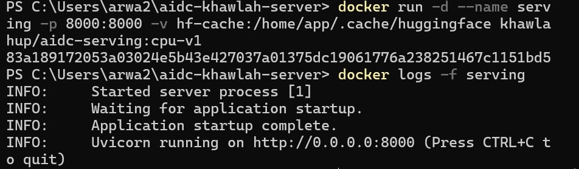
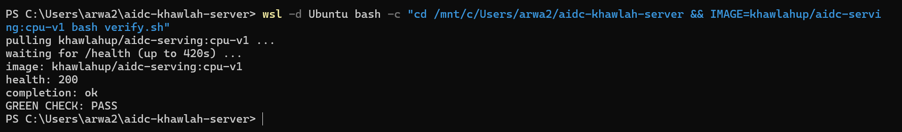

# Week 2, Day 3: containers & AI application deployment

Environment: Windows laptop (local), Docker Desktop 29.7.2 on WSL2 (Ubuntu integration)
Docker Hub: khawlahup

Three parts completed today, each in its own subfolder:

| Part | Folder | Status |
|---|---|---|
| Lab W2D3: containerise | `containerise/` | ✅ GREEN CHECK: PASS |
| Extra Lab: multi-stage build golf | `multistage-golf/` | ✅ GREEN CHECK: PASS |
| Bug Lab: the rebuild that never gets faster | `bug-lab/` | ✅ fixed, verified with cache hit |

## Predictions (filled before building)

| Question | Prediction |
|---|---|
| Final image size (code + CPU torch, no weights) | ~1.5-2 GB |
| If COPY . . comes before installing requirements, how many of next 10 code edits re-run pip install? | 10/10 |
| naive → slim image size | ~3 GB → ~1.5 GB |

## Actual results

| Field | Measured |
|---|---|
| naive build (full base, cached pip) | 16.8 GB |
| slim build (`khawlahup/aidc-serving:cpu-v1`) | 1.63 GB disk / 341 MB content |
| Savings | ~15.2 GB (~90%) |
| `docker push` | succeeded, digest `sha256:39b16567afbc...` |
| `verify.sh` (fresh pull from Docker Hub) | `GREEN CHECK: PASS` |

## Screenshots

## Notes

- `Dockerfile` uses `python:3.11-slim`, a non-root `app` user, and `--index-url https://download.pytorch.org/whl/cpu` so pip resolves the ~180 MB CPU build of torch instead of the ~2.5 GB default CUDA build.
- Model weights are **not** baked into the image. They are downloaded once into a named volume (`hf-cache`) mounted at `/home/app/.cache/huggingface`, so the image stays generic and reusable across model swaps.
- **Permissions fix applied:** the first `docker run` with the volume failed with `PermissionError: [Errno 13] Permission denied: '/home/app/.cache/huggingface/hub'`. Docker initializes a new named volume owned by root by default; since the container runs as the non-root `app` user, it could not write into it. Fixed by adding `RUN mkdir -p $HF_HOME && chown -R app:app /home/app/.cache` **before** `USER app` in the Dockerfile, so the volume inherits `app:app` ownership on first mount.
- Proved the volume persists the model: removed and re-ran the container, and the second run reached `Uvicorn running` immediately, with no `loading Qwen...` download step, confirming weights were read from the volume rather than re-downloaded.
- `docker rmi aidc-serving:naive` was run after recording its size, per the lab's instructions not to keep the naive image around.
- `verify.sh` was run through `wsl -d Ubuntu bash verify.sh` rather than natively in PowerShell, since the script is bash and PowerShell cannot execute it directly. This required enabling WSL Integration for the Ubuntu distro in Docker Desktop settings (Settings → Resources → WSL Integration), which was off by default.

---

See `multistage-golf/README.md` and `bug-lab/README.md` for the other two parts.
