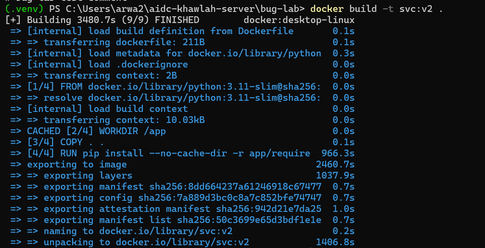
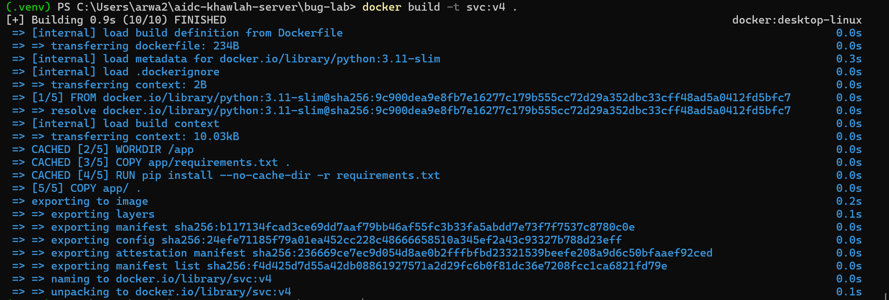

# Bug Lab W2D3: the rebuild that never gets faster

Reproduced the given bug (deliberately broken layer order: `COPY . .` before
`RUN pip install`), confirmed it, fixed it, and measured the difference.

## Predictions (filled before touching Docker)

| Question | Prediction |
|---|---|
| Will a one-line comment edit re-trigger `pip install` from scratch, even though `requirements.txt` is unchanged? | Yes |
| After the fix, will the rebuild after a code-only edit be seconds or minutes? | Seconds |

## Reproducing the bug

**v1** (first build, cold cache): `pip install` took 692.1s.

**v2** (after adding one comment line to `main.py`, `requirements.txt`
unchanged): `pip install` took **966.3s — re-ran from scratch**, not
`CACHED`.

```
=> CACHED [2/4] WORKDIR /app                              0.0s
=> [3/4] COPY . .                                         0.1s
=> [4/4] RUN pip install --no-cache-dir -r app/require  966.3s   <- not cached
```



`docker history` would show a fresh (non-cached) hash for the `pip install`
layer on v2, confirming the layer actually re-ran rather than just being
slow to report.

## Diagnosis

`COPY . .` copies the entire build context — including `main.py` — into a
single layer. Any edit to any file in that context invalidates that layer's
cache. Since `RUN pip install` sits **after** `COPY . .` in the Dockerfile,
it inherits the cache invalidation and reruns too, even though the actual
dependency list (`requirements.txt`) never changed.

## Fix

Split the copy: bring in only `requirements.txt` and install *before*
copying the rest of the code.

```dockerfile
FROM python:3.11-slim
WORKDIR /app
COPY app/requirements.txt .
RUN pip install --no-cache-dir -r requirements.txt
COPY app/ .
CMD ["uvicorn", "main:app", "--host", "0.0.0.0", "--port", "8000"]
```

## Verifying the fix

**v3** (first build with the corrected order, cold cache): `pip install`
took 1184.6s (expected — first build with this Dockerfile, nothing to cache
yet).

**v4** (after adding another comment line to `main.py`, same as before):

```
[+] Building 0.9s (10/10) FINISHED
=> CACHED [2/4] WORKDIR /app                                0.0s
=> CACHED [3/4] COPY app/requirements.txt .                 0.0s
=> CACHED [4/4] RUN pip install --no-cache-dir -r require   0.0s   <- CACHED!
=> [5/5] COPY app/ .                                        0.0s
```

**The entire build completed in under 1 second** — `pip install` was fully
cached, and only the tiny final `COPY app/ .` layer re-ran.



## Summary table

| Build | Dockerfile order | `pip install` time | Total build time |
|---|---|---|---|
| v1 (baseline) | code before install | 692.1s | ~48 min |
| v2 (edit, still broken) | code before install | 966.3s (re-ran from scratch) | ~58 min |
| v3 (first build, fixed order) | requirements before code | 1184.6s (expected, cold cache) | ~41 min |
| v4 (edit, fixed) | requirements before code | **0.0s (CACHED)** | **0.9s** |

The fix takes a one-line code edit from a ~15-minute rebuild to under a
second.
