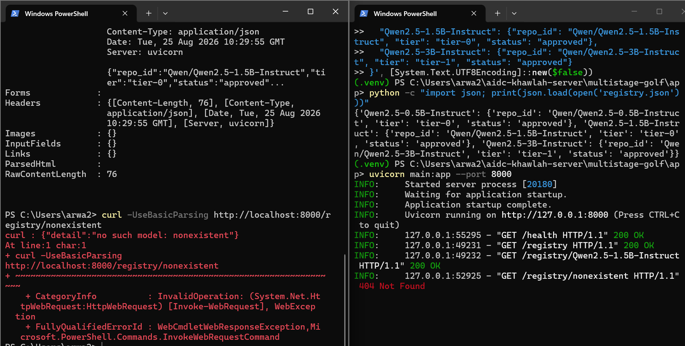
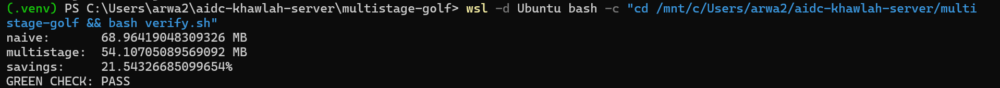

# Extra Lab W2D3: multi-stage build golf

A small model-registry FastAPI service (no ML libraries), built two ways to
compare a naive single-stage Dockerfile against a real multi-stage build.

## Predictions (filled before writing any Dockerfile)

| Question | Prediction |
|---|---|
| `python:3.11-slim` alone, roughly how many MB? | ~130 MB |
| Naive single-stage build (copies whole repo before installing) vs base image | ~150-200 MB bigger |
| Clean multi-stage build (base + fastapi/uvicorn/pydantic only) | ~200-230 MB total |

## Actual results

| Stage | Image size (`docker images` DISK USAGE) |
|---|---|
| naive single-stage (before `.dockerignore`, `.venv` leaked into context: 29.9 MB transferred) | 323 MB |
| naive single-stage (after adding `.dockerignore`) | **278 MB** |
| multi-stage | **237 MB** |
| Savings | 41 MB (14.7% by `docker images` size; 21.5% by `docker image inspect` byte-exact size used in `verify.sh`) |
| Target | 300 MB |
| Fits target | ✅ True |

## Local test (before touching Docker, per the lab's instructions)

All four required cases passed:

```
GET /health                          200 OK
GET /registry                        200 OK
GET /registry/Qwen2.5-1.5B-Instruct  200 OK
GET /registry/nonexistent            404 Not Found   (expected)
```



## `report_sizes.sh` output

```
naive single-stage:  278MB  (278.0 MB)
multi-stage:         237MB  (237.0 MB)
savings:             41.0 MB  (14.7%)
target:              300 MB
multi-stage fits target: True
```

## `verify.sh` output (green check)

```
naive:       68.96 MB
multistage:  54.11 MB
savings:     21.54%
GREEN CHECK: PASS
```



> Note: `report_sizes.sh` and `verify.sh` report different absolute MB numbers
> for the same two images (278 MB vs ~69 MB) because they measure size two
> different ways: `docker images --format "{{.Size}}"` (used by
> `report_sizes.sh`) reports the total size including shared base-image
> layers, while `docker image inspect --format='{{.Size}}'` (used in
> `verify.sh`) reports a different accounting of layer sizes. The
> **percentage savings** is the number that matters for the pass/fail
> threshold, and both scripts agree it is comfortably above the minimum.

## Notes

- Root cause of an early failure: `registry.json` was created with
  PowerShell's `Out-File -Encoding utf8`, which silently prepends a UTF-8
  BOM (byte-order mark). Python's `json.load()` choked on the BOM with
  `JSONDecodeError: Expecting value: line 1 column 1 (char 0)`, even though
  the file displayed correctly and had a plausible byte count. Fixed by
  rewriting the file with `[System.IO.File]::WriteAllText(...,
  [System.Text.UTF8Encoding]::new($false))`, which forces UTF-8 without a
  BOM.
- The multi-stage `Dockerfile` installs dependencies into an isolated
  `--prefix=/install/deps` in a `builder` stage, then `COPY --from=builder
  /install/deps /usr/local` copies only that directory into a fresh
  `runtime` stage — pip itself, its download cache, and anything else in the
  builder stage never reach the final image.
- `COPY app/main.py app/registry.json ./` (naming files explicitly) is used
  in the runtime stage rather than `COPY app/ .`, so `requirements.txt`
  itself isn't copied into the final image either.
