# Week 2, Day 4: the GPU image

Environment: Windows laptop (local, no NVIDIA GPU) + Google Colab (Tesla T4)
Docker Hub: khawlahup

This lab is split across two machines by design: Colab cannot run Docker, and
this laptop has no NVIDIA GPU. The proof is two halves that meet in one file,
`gpu_evidence.json`.

## Predictions (filled before building)

| Question | Prediction |
|---|---|
| `/health` status on the GPU-less laptop (CPU fallback) | 200 |
| tokens/s on laptop CPU for 128-token generation | ~3-5 |
| tokens/s on Colab T4 for the same generation | ~30-40 |
| Ratio T4:CPU | ~8-10x |

## Actual results

### Local half (laptop, Docker)

| Field | Measured |
|---|---|
| `Dockerfile.gpu` base | `nvidia/cuda:12.4.1-runtime-ubuntu22.04` |
| GPU image size (`khawlahup/aidc-serving:gpu-v1`) | 12.8 GB disk / 4.66 GB content |
| CPU image size for comparison (W2D3, `cpu-v1`) | 1.63 GB disk / 341 MB content |
| Size ratio (GPU vs CPU image) | ~7.9x disk / ~13.7x content |
| `docker build -f Dockerfile.gpu` | succeeded, ~25 min total |
| Container run **without** `--gpus` | `WARNING: The NVIDIA Driver was not detected` (expected), then `Uvicorn running` |
| `/health` on CPU fallback | 200, `{"status":"ok","model":"Qwen/Qwen2.5-0.5B-Instruct"}` |
| `docker push` | succeeded, digest `sha256:674a1767a6af...` |

### Colab half (T4 GPU)

| Field | Measured |
|---|---|
| GPU detected | Tesla T4 (`nvidia-smi` confirms, 15360 MiB total) |
| `generate_probe.py` output | `device: cuda (Tesla T4), dtype: torch.float16` |
| tokens/s on T4 | **31.4** |
| Model | Qwen/Qwen2.5-1.5B-Instruct |
| `gpu_evidence.json` | `{"cuda": true, "device_name": "Tesla T4", "tokens_per_s": 31.4, "model": "Qwen/Qwen2.5-1.5B-Instruct"}` |

### Green check (three-part)

```
part 1: GPU image resolved
part 2: /health 200 on CPU fallback
part 3: colab evidence shows cuda: true
GREEN CHECK: PASS
```

## Screenshots

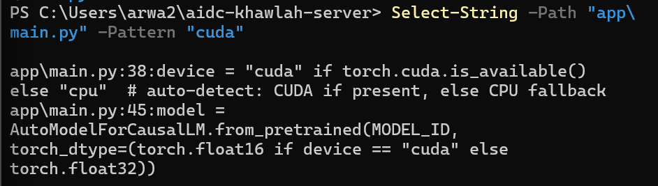
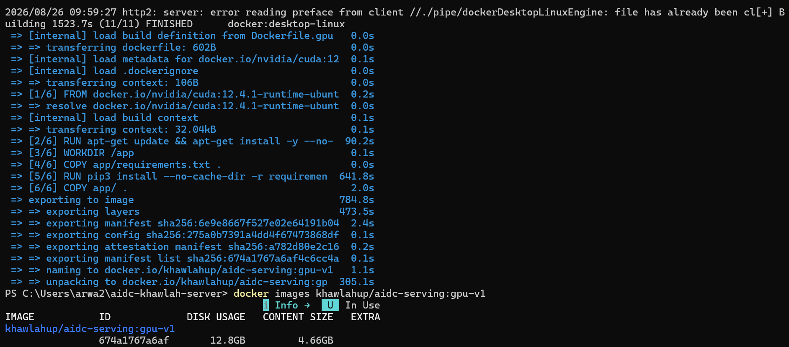
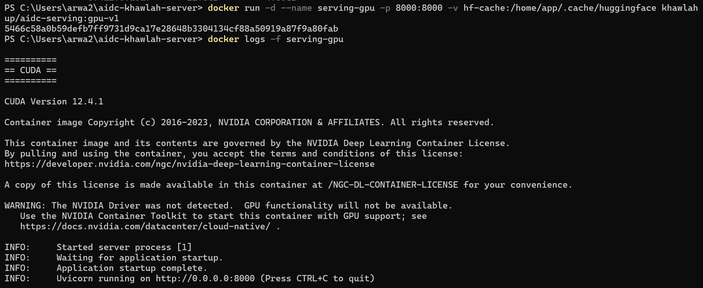
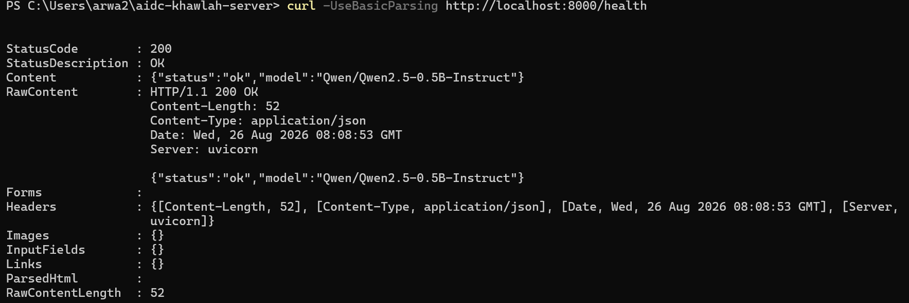
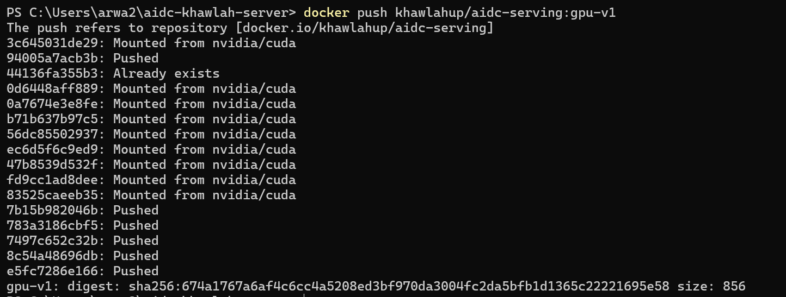
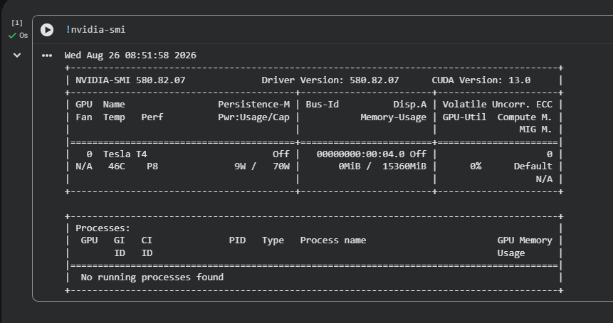
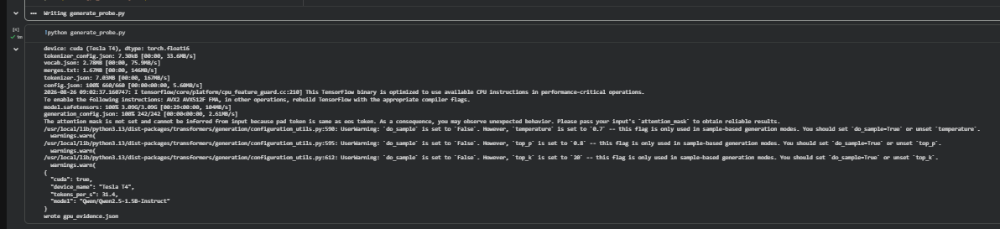
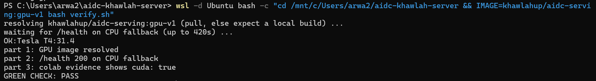

## Extra Lab: the device-agnostic sanity harness

A separate toy service in `sanity-harness/`, deliberately isolated from the
main `/v1` service (own request shape: `{"prompt": ..., "require_gpu": ...}`).
It proves the service tells the truth about its own device, and refuses a
GPU-only request with a clean 400 on CPU instead of crashing.

| Check | Result |
|---|---|
| `/health` reports device | `{"status":"ok","device":"cpu"}` |
| Normal request succeeds regardless of device | PASS |
| `require_gpu=true` on CPU refused cleanly (400, clear message) | PASS |
| Own `sanity_harness.py` | `GREEN CHECK: PASS` |
| Official independent `verify.py` | `GREEN CHECK: PASS` |

```
[PASS] health reports a valid device
[PASS] normal request succeeds regardless of device
[PASS] GPU-only request fails cleanly on CPU (400, clear message)
GREEN CHECK: PASS

server claims device=cpu
ok  require_gpu refused cleanly on cpu
GREEN CHECK: PASS
```

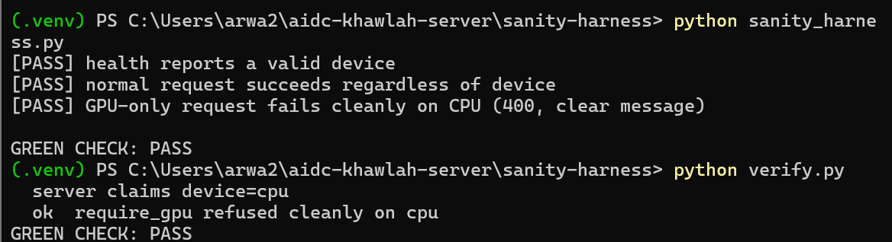

Tier 0 (the graded run) is the CPU run, run and passing here. The GPU run
would need this afternoon's Colab half or a tier-1 GPU pod and was not
attempted, since tier 0 was the scored requirement.

Files: `sanity-harness/app/main.py`, `sanity-harness/app/requirements.txt`,
`sanity-harness/sanity_harness.py`, `sanity-harness/verify.py`

## Bug Lab: the guard that only guards one door

Given, deliberately broken: `/v1/embeddings` had a guard that *looked* like
a device check but did nothing (`if DEVICE != "cuda": pass`), and its
response hard-coded `"device_used": "cuda"` regardless of the real device.

### Reproducing the bug

```powershell
curl -Method POST http://localhost:8000/v1/embeddings -Body '{}'
```

```json
{"vector":[0.1,0.1,0.1,0.1,0.1,0.1,0.1,0.1],"device_used":"cuda"}
```

**200 OK, claiming GPU, on a machine with no GPU.** No error, no warning —
just a wrong answer that looks completely normal.

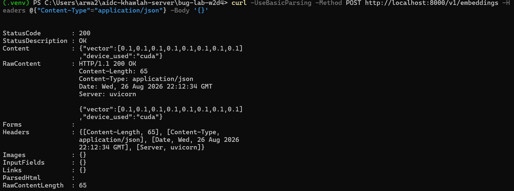

### Diagnosis

`/v1/chat/completions`'s guard (`if payload.get("require_gpu") and DEVICE
!= "cuda": raise ...`) actually *does something* with its condition — it
raises. `/v1/embeddings`'s guard evaluates the same kind of condition, then
does nothing with the result (`pass`). It has the shape of a check but not
the behavior of one. A missing guard would at least fail the same way
everywhere; a guard that silently does nothing looks reviewed and safe when
it isn't.

### Fix

```python
@app.post("/v1/embeddings")
def embeddings(payload: dict):
    if DEVICE != "cuda":
        raise HTTPException(400, "Embeddings require a GPU-backed instance; this instance is running in CPU-fallback mode.")
    return {"vector": [0.1] * 8, "device_used": DEVICE}
```

Two bugs fixed in the same two lines: the no-op guard now actually raises,
and the hard-coded `"device_used": "cuda"` was replaced with the real
`DEVICE` variable — it was lying even on a path that never runs on this
machine.

### Verify

```powershell
curl -Method POST http://localhost:8000/v1/embeddings -Body '{}'
# {"detail":"Embeddings require a GPU-backed instance; this instance is running in CPU-fallback mode."}
```

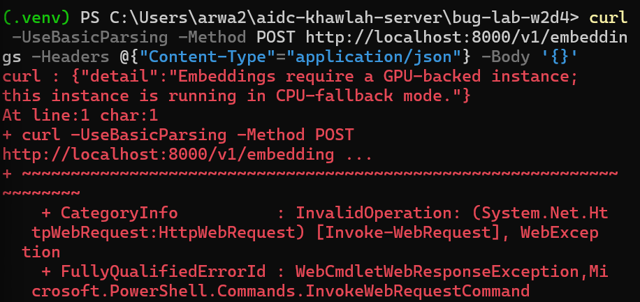

```python
import httpx
r = httpx.post("http://localhost:8000/v1/embeddings", json={})
assert r.status_code == 400, f"expected 400 on CPU, got {r.status_code}"
assert "GPU" in r.json()["detail"]
print("GREEN CHECK: PASS")
```

```
GREEN CHECK: PASS
```

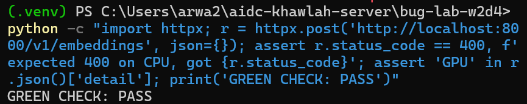

Files: `bug-lab/main.py`

## Notes

- `app/main.py` was updated to auto-detect the device instead of hard-coding
  CPU:
  ```python
  device = "cuda" if torch.cuda.is_available() else "cpu"
  ...
  torch_dtype=(torch.float16 if device == "cuda" else torch.float32)
  ```
  This is the same CPU-fallback pattern used by `app/generate_probe.py`,
  which is what lets one image and one script behave correctly on both a
  GPU-less machine and a GPU machine.
- `Dockerfile.gpu` installs Python 3.11 explicitly on top of the CUDA
  runtime base, since Ubuntu 22.04's default `python3` is 3.10, off the
  course's 3.11 baseline.
- Ran the container **without** `--gpus` on purpose, since the laptop has no
  NVIDIA runtime: the CUDA base itself printed a driver-not-detected
  warning, but the service still started and answered `/health` because the
  device-detection code degraded to CPU instead of crashing.
- The GPU image (12.8 GB) is roughly 8x the disk size of the CPU-only image
  from W2D3 (1.63 GB) — the CUDA runtime base plus the CUDA build of torch
  account for essentially all of that difference; the application code
  itself is the same few kilobytes on both.
- `docker push` was faster than the image size alone would suggest: most
  layers were `Mounted from nvidia/cuda` rather than freshly uploaded,
  since they're shared with the public `nvidia/cuda` base image already on
  Docker Hub. Only the layers this Dockerfile actually adds (Python
  install, pip install, app code) were pushed fresh.
- `gpu_evidence.json` was generated by running the *same*
  `app/generate_probe.py` script on a Colab T4 runtime (not a separate
  script), downloaded from Colab, and placed next to the repo for the local
  verifier to read as part 3 of the green check.
- `verify.sh` was run through `wsl -d Ubuntu bash verify.sh`, same as W2D3,
  since it's a bash script and PowerShell can't execute it directly.

Files: `Dockerfile.gpu`, `gpu_evidence.json`, `verify.sh`, `app/main.py`,
`app/generate_probe.py`, `app/schemas.py`, `app/requirements.txt`
