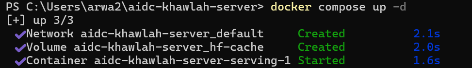
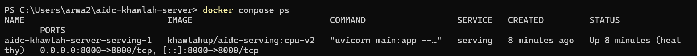
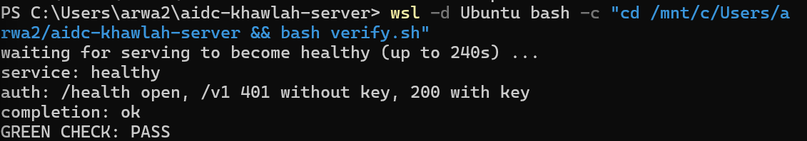

# Week 2, Day 5: the stack in one file, and who calls it

Environment: Windows laptop (local), Docker Desktop 29.7.2 on WSL2 (Ubuntu integration)
Docker Hub: khawlahup

This is the week-2 wrap: `docker run` by hand is replaced by a single
`compose.yaml`, the service is locked behind an API key, and the endpoint
becomes a contract another team (Agentic AI cohort) will call as real
traffic from week 4 onward.

## Predictions (filled before bringing anything up)

| Question | Prediction |
|---|---|
| Seconds until `docker compose ps` reports healthy | ~90-120s (model load + start_period) |
| Does changing `MODEL_ID` in `.env` and re-running `up -d` recreate the container? | Yes — compose detects the env change |
| Does the base image have `curl`? | No — `python:3.11-slim` has Python, not curl |
| Hours/days/weeks until someone else generates tokens on an unkeyed public port | Hours — an open port on a known framework gets probed fast |
| Which endpoint must still answer without a key after step 4, and why? | `/health` — Kubernetes probes in week 4 carry no key |

## Actual results

| Field | Measured |
|---|---|
| Image built | `khawlahup/aidc-serving:cpu-v2` (adds API_KEY + MAX_TOKENS on top of W2D3's cpu-v1) |
| `docker compose up -d` | succeeded — network, volume, and container created in ~2s |
| Time to `healthy` | within `start_period: 120s`, confirmed via `docker compose ps` |
| `/health` without key | 200 (stays open, as required) |
| `/v1/models` without key | 401 |
| `/v1/models` with `Bearer <key>` | 200 |
| `/v1/chat/completions` with key | valid `chat.completion`, non-empty `content` |
| `verify.sh` (official) | `GREEN CHECK: PASS` |

## Screenshots





## Notes

- `compose.yaml` pulls the image (`image: ${IMAGE}`) rather than building it;
  compose does not rebuild what's already on the registry.
- The healthcheck uses `python -c "..."`, **not** `curl` — `python:3.11-slim`
  does not have curl installed, and a curl-based healthcheck would silently
  fail every attempt while the service itself is perfectly healthy. This is
  exactly the failure mode covered by this day's Bug Lab.
- `hf-cache` is declared as a **named volume**, not a bind mount, so weights
  persist across `compose down`/`up` cycles without re-downloading.
- `main.py` was updated to read `API_KEY` and `MAX_TOKENS` from the
  environment (`os.environ.get(...)`), matching the same pattern already
  used for `MODEL_ID`. The auth check uses `if API_KEY and authorization !=
  f"Bearer {API_KEY}"` — when `API_KEY` is unset (empty string), the check
  short-circuits and the service runs open with a startup warning, matching
  the lab's requirement not to break Tuesday/Wednesday's keyless images.
- `/health` was left completely untouched — no auth check was added there,
  since Kubernetes probes in week 4 will call it without a key.
- `req.max_tokens = min(req.max_tokens, MAX_TOKENS)` silently clamps any
  request asking for more tokens than the configured ceiling, capping the
  worst-case cost a single caller can impose.
- **Bug hunted and fixed during this lab, not part of the official Bug Lab:**
  `.env` was created via PowerShell (`Out-File`), which writes Windows line
  endings (CRLF) by default. When `verify.sh` (running inside WSL/bash) read
  `HOST_PORT` from `.env`, the trailing `\r` was included in the value,
  producing a malformed URL and causing every `/health` probe to fail with
  status `000`. Confirmed with `cat -A .env` (showed `^M` at each line end)
  and fixed by rewriting the file with LF-only line endings:
  ```powershell
  (Get-Content ".env" -Raw) -replace "`r`n", "`n" | Set-Content ".env" -NoNewline
  ```
  This is the same class of cross-platform text-encoding issue as the UTF-8
  BOM bug from W2D2 (`registry.json`) — any file authored in PowerShell for
  a Linux-side script should be checked for encoding immediately.
- `verify.sh` was run via `wsl -d Ubuntu bash -c "..."`, same as every prior
  day's bash-only verifier, since PowerShell cannot execute bash scripts
  directly.

Files: `compose.yaml`, `.env.example`, `verify.sh`, `app/main.py`,
`app/schemas.py`, `app/requirements.txt`
