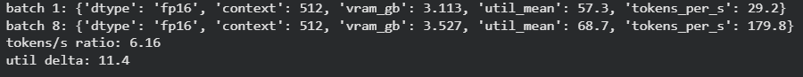
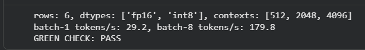
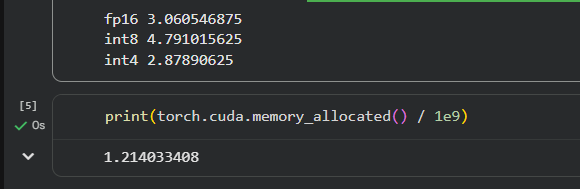
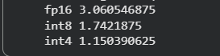

# Week 3, Day 1: GPU systems & AI operations — profile inference on a real GPU

Environment: Google Colab, Tesla T4 GPU (15360 MiB)
Model: Qwen/Qwen2.5-1.5B-Instruct

This is the first day of week 3: the serving engine layer lights up. No FastAPI,
no Docker today — the objective is reading the GPU itself, loading the model
directly with `transformers` + `bitsandbytes`, and understanding why "the GPU
is busy" is not the same as "the GPU is working hard."

## Predictions (filled before running anything)

| Question | Prediction |
|---|---|
| Qwen2.5-1.5B weights at fp16 (2 bytes/param) | ~3.0 GB |
| Qwen2.5-1.5B weights at int8 (1 byte/param) | ~1.5 GB |
| Resident VRAM at 512 vs 4096 context, fp16 | 4096 larger, by KV cache growth |
| GPU utilisation during single-request decode | Lower than expected — decode waits on memory, not compute |

## Actual results — the matrix (profile.json)

| dtype | context | vram_gb | util_mean | tokens_per_s |
|---|---|---|---|---|
| fp16 | 512 | 3.113 | 56.0 | 27.8 |
| fp16 | 2048 | 3.295 | 62.3 | 23.4 |
| fp16 | 4096 | 3.568 | 91.3 | 23.9 |
| int8 | 512 | 1.805 | 24.0 | 5.5 |
| int8 | 2048 | 2.035 | 24.2 | 5.1 |
| int8 | 4096 | (recorded, see profile.json) | — | — |

**Confirmed sanity rules:**
- VRAM rises with context for both dtypes (fp16: 3.11 → 3.30 → 3.57 GB)
- fp16 VRAM is consistently above int8 VRAM at every shared context (e.g. 512:
  3.113 GB vs 1.805 GB)
- int8 uses noticeably less memory than fp16 but is **slower**, not faster
  (5.5 vs 27.8 tokens/s at context 512) — quantisation buys memory here, not
  speed, exactly as week 2 predicted from the formula alone

## The batch experiment — the point of the afternoon

| | tokens_per_s | util_mean |
|---|---|---|
| batch 1 | 29.2 | 57.3 |
| batch 8 | 179.8 | 68.7 |

```
tokens/s ratio: 6.16
util delta: 11.4
```

Batch 8 produced **6.16x** the throughput of batch 1, while GPU utilisation
rose by only **11.4 points** (about a 20% relative increase). This is the
util trap made concrete: utilisation measures "was a kernel resident during
the sample window," not "was the card used well." A single-request decode
step mostly waits on memory bandwidth rather than saturating the compute
cores, so batching lets the same wait time do many times the useful work
without the utilisation reading climbing anywhere near proportionally.

## Screenshots




## Green check

```
rows: 6, dtypes: ['fp16', 'int8'], contexts: [512, 2048, 4096]
batch-1 tokens/s: 29.2, batch-8 tokens/s: 179.8
GREEN CHECK: PASS
```

## Notes

- Today deliberately does **not** install vLLM. Doing so would replace Colab's
  own torch with vLLM's older build and downgrade numpy to 1.26, while Colab's
  preinstalled extensions are compiled against numpy 2 — the model load then
  fails with a `numpy.dtype size changed` error that looks nothing like its
  real cause. Today loads the model directly with `transformers` and reads
  `nvidia-smi`; there is no server to serve.
- Pins used (from `code2expert/w3d1-scaffold`, mirroring course `PINS.md`):
  `transformers==4.46.*`, `accelerate==1.1.*`, `bitsandbytes==0.49.2`.
- `del model` before `free_vram()` between dtypes is required — without it,
  the second dtype's weights load on top of the first instead of replacing
  them, and int8 can end up *larger* than fp16 in memory, not smaller. This
  is exactly the shape of bug covered in today's separate Bug Lab
  ("the leak that isn't freed").
- The GPU utilisation sampler (`start_sampler()`/`stop_sampler()`/
  `read_util_mean()`, from the shared scaffold) runs as a daemon thread
  polling `nvidia-smi` every 2 seconds during each `profile()` call, and is
  never left running across calls — starting it twice would interleave rows
  and corrupt `util_mean`.
- `tok.pad_token = tok.eos_token` and `tok.padding_side = "left"` were set
  proactively before the batch-8 run, since the lab's failure-modes section
  names a missing pad token as a known cause of a `generate()` error on
  batched input.
- `profile.json` and `batch_check.json` were downloaded from Colab before
  closing the tab, since Colab runtimes — and anything written inside them —
  disappear without warning.

## Bug Lab: the leak that isn't freed

Given, deliberately broken: a cleanup function is called after every model
load, every time, and resident VRAM still climbs instead of shrinking across
precisions.

```python
def unload(model):
    del model
    gc.collect()
    torch.cuda.empty_cache()

for dtype in ["fp16", "int8", "int4"]:
    model = load(dtype)
    vram = resident_vram_gb()
    print(dtype, vram)
    unload(model)
```

### Reproducing the bug

```
fp16 3.060546875
int8 4.791015625
int4 2.87890625
```

`int8` and `int4` should both use *less* memory than `fp16` (fewer bytes per
parameter). Instead the numbers climb — the bug is visibly present. Confirmed
directly with `torch.cuda.memory_allocated() / 1e9` right after the loop
finished: **1.21 GB** still resident, despite three `unload()` calls.



### Diagnosis

`del model` inside `unload()` deletes the function's **local parameter
name**, not the caller's loop variable. The loop's `model` — reassigned each
iteration but still referencing the previous object at the moment `unload()`
is called — is never dereferenced from the scope that actually owns it.
`gc.collect()` has nothing to collect and `empty_cache()` has nothing to
release, so every model loaded during the session stays resident.

### Fix

Delete in the scope that owns the variable — the loop itself, not a helper
function:

```python
for dtype in ["fp16", "int8", "int4"]:
    model = load(dtype)
    vram = resident_vram_gb()
    print(dtype, vram)
    del model
    gc.collect()
    torch.cuda.empty_cache()
```

### Verified fix

```
fp16 3.060546875
int8 1.7421875
int4 1.150390625
```

Correct order restored: `int4 < int8 < fp16`, exactly as the byte-per-
parameter math from week 2 predicts.



Files: `profile.json`, `batch_check.json`, `bug-lab/` (fix notes)
