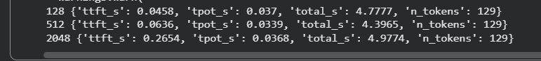
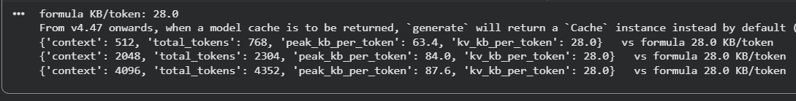
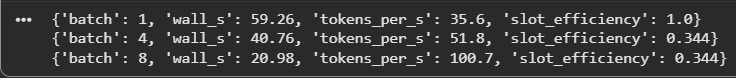
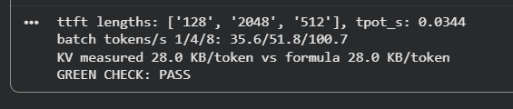
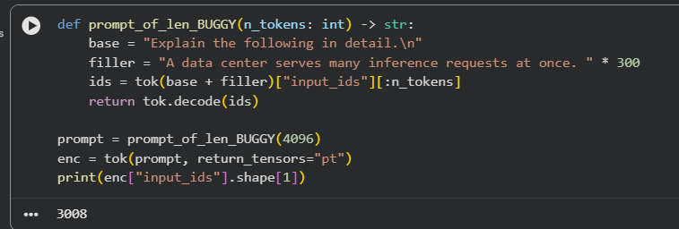
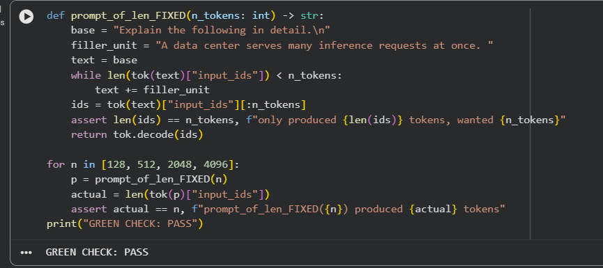
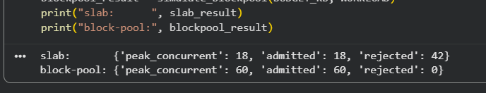
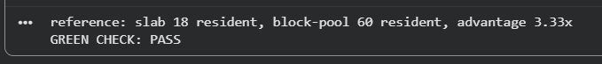

# Week 3, Day 2: inference anatomy, by hand - concurrency and batching

Environment: Google Colab, Tesla T4 GPU (15360 MiB)
Model: Qwen/Qwen2.5-1.5B-Instruct (fp16)

Second day of week 3. No vLLM today either (same numpy-downgrade crash as
day 1) — everything is hand-rolled directly against `transformers`, so
tomorrow's engine (vLLM) has an honest, hand-built baseline to beat.

## Predictions (filled before running anything)

| Question | Prediction |
|---|---|
| TTFT direction as prompt length grows | Up — prefill reads the whole prompt |
| What TPOT depends on | Model size and memory bandwidth (memory-bound), not prompt length |
| KV cache for Qwen2.5-1.5B (28 layers, 2 KV heads, head_dim 128, fp16) | 2أ—28أ—2أ—128أ—2 / 1024 = 28.0 KB/token |
| Static batch finish condition | The batch finishes when the slowest/longest prompt finishes |

## Actual results

### TTFT rises with prompt length, TPOT stays flat

| context | ttft_s | tpot_s |
|---|---|---|
| 128 | 0.0458 | 0.0370 |
| 512 | 0.0636 | 0.0339 |
| 2048 | 0.2654 | 0.0368 |

TTFT climbed **~5.8x** from 128 to 2048 tokens (prefill reads the whole
prompt before the first token). TPOT stayed within noise (0.034-0.037s)
across all three lengths, confirming decode is a fixed memory-bound step
regardless of how long the prompt was.



### KV cache matches the arithmetic formula exactly

```
formula KB/token: 28.0
context 512:  kv_kb_per_token = 28.0  (peak_kb_per_token = 63.4)
context 2048: kv_kb_per_token = 28.0  (peak_kb_per_token = 84.0)
context 4096: kv_kb_per_token = 28.0  (peak_kb_per_token = 87.6)
```

The cache-only figure (`kv_kb_per_token`) landed on **exactly 28.0** at
every context length tested — an exact match to the hand-computed formula,
not an approximation. The whole-generation peak (`peak_kb_per_token`) reads
2-3x higher and climbs with context: that gap is activations and allocator
workspace during prefill riding on top of the cache in the same
measurement, not the cache itself. "What must I budget per concurrent
user?" wants the cache figure; "will this request OOM the card?" wants the
peak.



### Static batching and the straggler tax

Queue: `[32, 32, 32, 256] * 6` — mostly short requests, a few long ones,
mimicking a realistic mixed-length workload.

| batch | tokens_per_s | slot_efficiency |
|---|---|---|
| 1 | 35.6 | 1.000 |
| 4 | 51.8 | 0.344 |
| 8 | 100.7 | 0.344 |

Throughput rose **2.83x** from batch 1 to batch 8 — roughly half of the
~5.6x a uniform-length queue would have given, exactly as the lab predicts
for a mixed-length one. `slot_efficiency` collapsed from a perfect 1.0 at
batch 1 to **0.344** the moment sequences of different lengths were batched
together, and stayed flat at every larger batch size: two thirds of what
the GPU decodes at batch 4/8 is short requests sitting finished in a slot
they can't release, waiting for the 256-token member. That is the
straggler tax as a measured number rather than a claim — and it's exactly
what continuous batching (tomorrow, with vLLM) removes.



### Green check

```
ttft lengths: ['128', '2048', '512'], tpot_s: 0.0344
batch tokens/s 1/4/8: 35.6/51.8/100.7
KV measured 28.0 KB/token vs formula 28.0 KB/token
GREEN CHECK: PASS
```



## Bug Lab: the prompt that wasn't as long as you asked

Given, deliberately broken `prompt_of_len()`: builds a filler string of a
fixed size, then slices to the requested token count. Python list slicing
past the end of a list does not raise — it silently returns everything
that's actually there.

```python
def prompt_of_len(n_tokens: int) -> str:
    base = "Explain the following in detail.\n"
    filler = "A data center serves many inference requests at once. " * 300
    ids = tok(base + filler)["input_ids"][:n_tokens]
    return tok.decode(ids)
```

### Reproducing the bug

```python
prompt = prompt_of_len(4096)
enc = tok(prompt, return_tensors="pt")
print(enc["input_ids"].shape[1])
# 3008
```

Asked for a 4096-token prompt, got **3008** — no exception anywhere.
Confirmed the real ceiling directly:

```python
full_ids = tok(base + filler)["input_ids"]
print(len(full_ids))
# 3008
```

`filler * 300` produces a fixed ~3008-token text; asking for more than that
via `[:4096]` just hands back everything available, silently.



### Fix

Grow the filler until it's actually long enough, and assert the result
before trusting it downstream:

```python
def prompt_of_len(n_tokens: int) -> str:
    base = "Explain the following in detail.\n"
    filler_unit = "A data center serves many inference requests at once. "
    text = base
    while len(tok(text)["input_ids"]) < n_tokens:
        text += filler_unit
    ids = tok(text)["input_ids"][:n_tokens]
    assert len(ids) == n_tokens, f"only produced {len(ids)} tokens, wanted {n_tokens}"
    return tok.decode(ids)
```

### Verified fix

```
GREEN CHECK: PASS
```

Tested at 128, 512, 2048, and 4096 — every length, including the one that
silently failed before, now produces exactly the token count requested.



## Extra Lab: the paged KV allocator

A pure Python, no-GPU exercise: hand-build a miniature PagedAttention block
allocator and measure how much more concurrency it supports than the naive
"reserve a max-length slab per sequence" approach, at the same fixed 2 GB
memory budget.

### Slab vs. block-pool, same budget, same workload

Deterministic workload (`random.seed(7)`, 60 sequences, 85% short 50-400
tokens, 15% long 2000-4096 tokens): mean length 444.4, max 3763 — an exact
match to the lab's reference numbers.

```
slab:       {'peak_concurrent': 18, 'admitted': 18, 'rejected': 42}
block-pool: {'peak_concurrent': 60, 'admitted': 60, 'rejected': 0}
```

The slab allocator reserves for the theoretical maximum (4096 tokens) at
admission regardless of real length, so it can only ever hold
`2 GB / (4096 أ— 28 KB) = 18` sequences. The block-pool allocator only takes
the blocks each sequence's real length needs, growing block by block, so
it admitted **all 60** at the same budget — a **3.33x** concurrency
advantage, well above the lab's 1.5x bar.



### Green check

The official verifier recomputes the workload and both allocators from its
own independent reference implementation and demands an exact match
(the lab is fully deterministic, so approximate agreement isn't good
enough):

```
reference: slab 18 resident, block-pool 60 resident, advantage 3.33x
GREEN CHECK: PASS
```



## Notes

- Today deliberately does **not** install vLLM, same reason as day 1:
  installing it drags numpy below 2, and a direct `AutoModelForCausalLM`
  load in that runtime then dies with `numpy.dtype size changed`. Today's
  cells talk to the model directly with `transformers`, so today is a
  profiling-set-only install day.
- TTFT can only be measured with `TextIteratorStreamer` running generation
  on a background thread and timestamping each yield on the main thread. A
  plain `generate()` call returns only after the last token, so its
  wall-clock time is total generation time, not first-token time — the
  lab's named failure mode.
- The KV measurement resets `torch.cuda.reset_peak_memory_stats()` before
  each run and reads `max_memory_allocated()` after
  `torch.cuda.synchronize()`; skipping the reset reads a stale peak left
  over from a previous measurement.
- `baselines.json` was downloaded from Colab **immediately** after Cell 5
  wrote it, before touching anything else in the session — tomorrow's A/B
  comparison (day 3) depends entirely on this file surviving a lost
  runtime.
- The Bug Lab fix and the Extra Lab were both run in the same Colab
  session as the main lab, reusing the already-loaded model and tokenizer;
  no separate runtime was needed.

Files: `baselines.json`, `kv_check.json`, `extra-lab/kv_sim_report.json`
