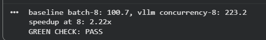
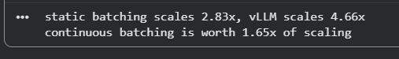
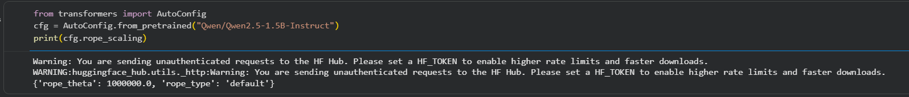
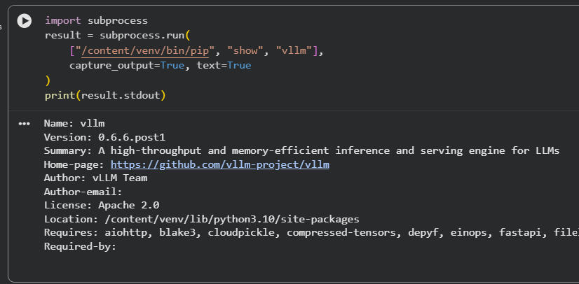
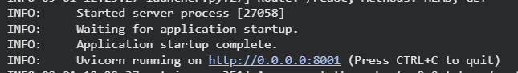
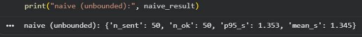
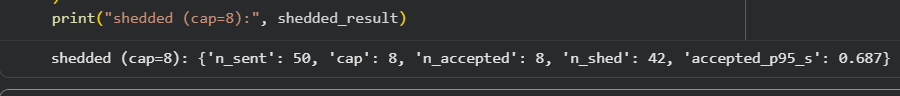
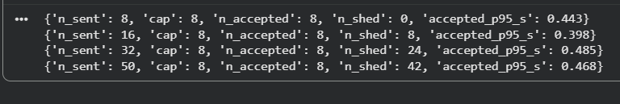
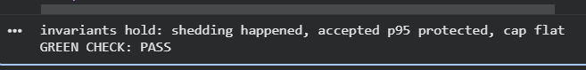

# Week 3, Day 3: the engine swap - vLLM behind the same /v1

Environment: Google Colab, Tesla T4 GPU (15360 MiB)
Model: Qwen/Qwen2.5-1.5B-Instruct (dtype half)
vLLM: installed in an isolated Python 3.10 virtual environment (`/content/venv`)
rather than directly into Colab's Python 3.12 base environment.

The interface held, so the engine slid under it: this day replaces every
hand-rolled measurement cell from days 1 and 2 with a real vLLM server behind
the identical OpenAI-compatible `/v1` API the week-2 client already speaks أ¢â‚¬â€‌
zero changes to the client code, only the engine underneath it.

## Predictions (filled before running anything)

| Question | Prediction |
|---|---|
| vLLM concurrency-8 throughput vs Monday's static-batch-8 | A few times higher |
| Static batching's own 1أ¢â€ â€™8 scaling multiple (from baselines.json) | 100.7 / 35.6 أ¢â€°ث† 2.83x |
| vLLM's own 1أ¢â€ â€™8 scaling multiple | Larger than static's |
| Direction and rough size of the gap | Larger, roughly 1.5-2x more scaling than static batching, because vLLM does not pay the straggler tax measured on day 2 |

## Actual results

### Installation note: isolated venv, not Colab's base Python

Colab's base runtime ships Python 3.12; vLLM 0.6.x's compiled wheels target
older Python. Rather than installing into Colab's base environment directly
(the approach used on days 1-2, which only needed `transformers`), today's
install created a dedicated Python 3.10 virtual environment first:

```
python3.10 -m venv /content/venv
/content/venv/bin/python -m pip install "vllm==0.6.*" "transformers==4.46.*" \
    "accelerate==1.1.*" "httpx==0.27.*" "openai==1.54.*"
```

142 packages installed cleanly, resolving to `vllm-0.6.6.post1`,
`torch-2.5.1`, `transformers-4.46.3`. The server was then launched and every
client-side call routed through `/content/venv/bin/python` explicitly.

### The seam test

```python
from openai import OpenAI
client = OpenAI(base_url="http://localhost:8000/v1", api_key="not-needed")
r = client.chat.completions.create(
    model="Qwen/Qwen2.5-1.5B-Instruct",
    messages=[{"role": "user", "content": "In one sentence, what is a GPU?"}],
)
```

Returned a valid completion immediately أ¢â‚¬â€‌ the exact week-2 client code,
unmodified, now talking to vLLM instead of a hand-rolled `transformers` call.

### The A/B sweep (24 requests per level, mixed 32/256-token queue)

| concurrency | vLLM tokens/s | static baseline (day 2) |
|---|---|---|
| 1 | 47.9 | 35.6 |
| 4 | 159.9 | 51.8 |
| 8 | 223.2 | 100.7 |

```
baseline batch-8: 100.7, vllm concurrency-8: 223.2
speedup at 8: 2.22x
GREEN CHECK: PASS
```



### The real lesson: scaling multiple, not per-level speedup

```
static batching scales 2.83x
vLLM scales 4.66x
continuous batching is worth 1.65x of scaling
```

This is the number the day turns on. Static batching's own 1أ¢â€ â€™8 multiple
(2.83x) matches day 2's measurement almost exactly. vLLM's own 1أ¢â€ â€™8 multiple
(4.66x) is well above the reference range (~4x, validated 3.88x on a
separate T4 run) but in the same direction and magnitude. The gap traces
straight back to day 2's `slot_efficiency` collapsing to ~0.344 under mixed
output lengths: continuous batching evicts a finished sequence and admits a
waiting one on the very next step, so it never pays that straggler tax and
its curve keeps climbing where the static one flattens.



Submitted to the progress board: concurrency-8 throughput = 223.2 tokens/s.

## Bug Lab: the config format your engine doesn't speak yet

The lab is explicit that this bug is drawn from a real, currently
unresolved case, and that the fix path is not guaranteed أ¢â‚¬â€‌ the actual
exercise is the three-fact diagnosis, not a guaranteed resolution.

### Fact 1: the model's real `rope_scaling` config

```python
from transformers import AutoConfig
cfg = AutoConfig.from_pretrained("Qwen/Qwen2.5-1.5B-Instruct")
print(cfg.rope_scaling)
# {'rope_theta': 1000000.0, 'rope_type': 'default'}
```

No `factor` key anywhere أ¢â‚¬â€‌ this model uses the simplest possible RoPE
configuration, not the extended-context format the described bug's
traceback complains about.



### Fact 2: the installed vLLM version

```
Name: vllm
Version: 0.6.6.post1
```

Newer than the `vllm==0.6.2` named in the bug scenario. Pinning
`vllm==0.6.*` in the install command resolved to the latest patch release
within that range, not the exact version that hit the bug.



### Attempting reproduction anyway: forcing the exact old version

To follow the lab's diagnostic path completely rather than stopping at "not
applicable," a second isolated environment was built and pinned to the
exact version named in the bug report:

```
python3.10 -m venv /content/venv_old
/content/venv_old/bin/python -m pip install "vllm==0.6.2" \
    "transformers==4.46.*" "accelerate==1.1.*"
```

Launched against the same model, on port 8001 to avoid colliding with the
main server:

```
INFO:     Started server process [27058]
INFO:     Application startup complete.
INFO:     Uvicorn running on http://0.0.0.0:8001
```

The server started cleanly أ¢â‚¬â€‌ no `KeyError: 'factor'`, no crash of any
kind أ¢â‚¬â€‌ even on the exact pinned version named in the bug scenario.



### Honest conclusion

The bug did not reproduce with either the resolved `0.6.6.post1` or the
exact pinned `0.6.2`. The most consistent explanation, given the three
facts gathered: the bug is specific to models whose config actually
contains an extended `rope_scaling` dict with a `factor` key (context-
extension variants), not to `Qwen2.5-1.5B-Instruct`'s config, which never
carries that field regardless of the vLLM version reading it. This model is
naturally immune to this particular gap, independent of engine version أ¢â‚¬â€‌
a negative result, documented with the same three-fact discipline the lab
asks for rather than a forced "fix."

Files: `bug-lab/` (diagnosis notes, no separate fix script needed)

## Extra Lab: load shedding under overload

A client-side admission-control layer in front of vLLM: reject requests
immediately once too many are already in flight, instead of queuing
everything, to protect p95 latency for the requests that do get in.

### Naive unbounded burst vs. shedded burst (n=50, cap=8)

```
naive (unbounded):    n_sent=50, n_ok=50, p95_s=1.353, mean_s=1.345
shedded (cap=8):      n_sent=50, n_accepted=8, n_shed=42, accepted_p95_s=0.687
```




Accepted p95 dropped by roughly half (0.687s vs 1.353s, well inside the
green check's required أ¢â€°آ¤0.8x margin) أ¢â‚¬â€‌ the 8 requests that got a slot saw
close to normal single-batch latency, while the other 42 were told no
immediately instead of silently degrading everyone's wait.

### Sweep: burst size 8/16/32/50, cap fixed at 8

| n_sent | n_accepted | n_shed | accepted_p95_s |
|---|---|---|---|
| 8 | 8 | 0 | 0.443 |
| 16 | 8 | 8 | 0.398 |
| 32 | 8 | 24 | 0.485 |
| 50 | 8 | 42 | 0.468 |

`accepted_p95_s` stayed essentially flat (0.398-0.485s, a 1.22x spread,
well under the green check's 2.5x ceiling) while `n_shed` climbed
monotonically with burst size. The cap holds latency steady for whoever
gets in; the visible cost is the climbing reject count, not a hidden
latency blowup for everyone.



### Green check

```
invariants hold: shedding happened, accepted p95 protected, cap flat
GREEN CHECK: PASS
```



Files: `extra-lab/shedding_report.json`

## Notes

- vLLM was installed into an isolated virtual environment
  (`/content/venv`) rather than Colab's base Python, because Colab's base
  runtime has moved to Python 3.12 and vLLM 0.6.x's wheels target older
  Python versions. Every client cell that talked to the installed packages
  used `/content/venv/bin/python` explicitly rather than relying on the
  notebook kernel's default interpreter.
- `--dtype half` is mandatory on the T4: it's Turing silicon (sm75), has no
  bf16 support and no FlashAttention-2, so vLLM falls back to the xformers
  backend. The startup log's `Cannot use FlashAttention-2 backend for Volta
  and Turing GPUs` line is expected, not an error.
- The A/B client (`ab_client.py`) reuses day 2's exact mixed-length queue
  (`[32, 32, 32, 256] * 6`) on purpose أ¢â‚¬â€‌ asking every request for the same
  token count would give static batching no straggler to pay for and
  continuous batching nothing to win back, making the whole comparison
  meaningless.
- Per the lab's own caution: `speedup_by_concurrency` does not rise cleanly
  with concurrency (1.35x, 3.09x, 2.22x) because it's a ratio of two curves
  with only 24 requests per level أ¢â‚¬â€‌ not enough queue depth to read a clean
  trend at the top level. The scaling-multiple comparison
  (`static_scaling` vs `vllm_scaling`) is the robust number; the per-level
  speedup is not.
- Two separate isolated vLLM installs coexisted in the same runtime for
  the Bug Lab reproduction attempt (`/content/venv` for the main day's
  work, `/content/venv_old` pinned to the exact bug-report version) أ¢â‚¬â€‌
  each on its own port, cleanly shut down before moving to the next
  section.

Files: `ab_report.json`, `bug-lab/`, `extra-lab/shedding_report.json`
