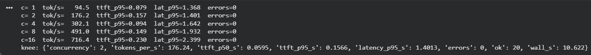
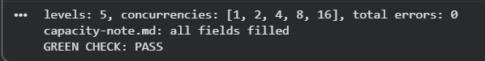
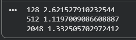
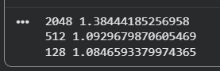
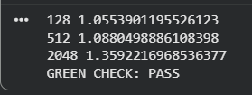

# Week 3, Day 5: the benchmark harness

Environment: Google Colab, Tesla T4 GPU (15360 MiB)
Isolated venv (Python 3.10, `/content/venv`) - same setup pattern as days 3-4.
Model: **Qwen/Qwen2.5-1.5B-Instruct-AWQ** - the locked model from day 4,
served with its exact locked flags.

Final day of week 3: run the given benchmark harness (`bench.py`, not
written by hand) against the locked model, sweep concurrency, find the
knee where p95 crosses the SLO while throughput has stopped delivering
real capacity, and publish tokens/s and p95 to the progress board.

## Predictions (filled before running anything)

| Question | Prediction |
|---|---|
| Rough concurrency where the knee sits | Somewhere in the low-to-mid range of the sweep |
| Target p95 SLO for today | 1.5 seconds |

## Actual results

### The full sweep (concurrency 1, 2, 4, 8, 16; 20 requests per level)

```
conc     tok/s   ttft_p50   ttft_p95   lat_p95    ok   err
----------------------------------------------------------
   1     94.53      0.050      0.079     1.368    20     0
   2    176.24      0.059      0.157     1.401    20     0
   4    302.06      0.066      0.094     1.642    20     0
   8    491.02      0.064      0.149     1.932    20     0
  16    716.39      0.221      0.230     2.399    20     0
```

Zero errors across all five levels and 100 total requests. Throughput
climbed strongly and monotonically across the entire sweep - a 7.6x
increase from concurrency 1 to 16, with no sign of flattening - while
`latency_p95_s` climbed steadily from 1.368s to 2.399s over the same
range.



### Finding the knee (SLO = 1.5s)

```python
TARGET_P95_S = 1.5
knee: {'concurrency': 2, 'tokens_per_s': 176.24, 'latency_p95_s': 1.4013}
```

Concurrency 2 is the last level still under the 1.5s target
(1.401s); concurrency 4 already breaches it (1.642s). The knee sits early
in the sweep, not near its upper end - throughput was still climbing
strongly well past the point where latency crossed the SLO, meaning the
system's raw throughput ceiling and its latency ceiling are governed by
different mechanisms at this concurrency range (see "the limiting family"
below).

### Why the knee, not the peak

Concurrency 16 produced the highest raw throughput measured (716.4
tokens/s, more than 4x the knee's number) - but at that level p95 latency
(2.399s) already exceeds the 1.5s SLO by 60%. Reporting 716.4 tokens/s as
"capacity" would mean promising a rate this stack only delivers by making
every real user wait past the target. The knee's 176.24 tokens/s at
concurrency 2 is the number that respects the SLO actually being
promised; everything past it is throughput purchased with a latency the
service isn't allowed to charge.

### The limiting family

Per `capacity-note.md`: overhead-bound at this concurrency range.
Throughput never flattened across the full 1-to-16 sweep (still climbing
strongly at the top level), which rules out a hard compute or memory
ceiling being hit yet - the p95 SLO breaks first, before either of those
would. That pattern is consistent with per-request scheduling and queueing
overhead accumulating faster than raw serving capacity is exhausted:
requests pile up behind each other under load well before the GPU itself
runs out of room to do more work.

### Green check

```
levels: 5, concurrencies: [1, 2, 4, 8, 16], total errors: 0
capacity-note.md: all fields filled
GREEN CHECK: PASS
```



## Week 3 checkpoint reached

vLLM live, benchmark numbers published (176.24 tokens/s at the knee,
concurrency 2), model locked since day 4. The Engine Swap badge for the
week.

Files: `bench_report.json`, `knee.json`, `capacity-note.md`

## Bug Lab: the benchmark that graded the wrong contestant

Given, deliberately broken: a loop timing multiple context lengths with no
warm-up call. The first config tested absorbs a one-time CUDA/allocator
cost that has nothing to do with prompt length, making it look artificially
slow regardless of which config happens to run first.

### Reproducing the bug

```python
results = {}
for context in [128, 512, 2048]:
    prompt = prompt_of_len(context)
    t0 = time.time()
    out = model.generate(**tok(prompt, return_tensors="pt").to("cuda"), max_new_tokens=32)
    results[context] = time.time() - t0
```

```
128:  2.622s
512:  1.120s
2048: 1.333s
```

128 tokens (the shortest prompt) came out slowest, more than 2x the
512-token result - backwards from every theory the week covered.



### Confirming it's a loop-position effect, not a real property

Reordering the list to `[2048, 512, 128]` and rerunning:

```
2048: 1.384s
512:  1.093s
128:  1.085s
```

Whichever config now runs first (2048) becomes the slowest, and the
previous slowest (128) becomes the fastest - conclusive proof the "slow"
result tracks loop position, not prompt length.



### First fix attempt hit the lab's own documented failure mode

A warm-up call at 64 tokens was tried first:

```python
_ = model.generate(**tok(prompt_of_len(64), return_tensors="pt").to("cuda"), max_new_tokens=8)
```

Result: `128: 1.088s, 512: 1.085s, 2048: 1.531s` - the assertion
`results[128] < results[512] < results[2048]` failed, since 128 came out
marginally slower than 512. This matches the lab's own named failure mode
exactly: a warm-up shorter than the shortest real config doesn't fully
prime every kernel path the real configs exercise.

### Verified fix: warm-up length matched to the shortest real config

```python
_ = model.generate(**tok(prompt_of_len(128), return_tensors="pt").to("cuda"), max_new_tokens=8)

results = {}
for context in [128, 512, 2048]:
    prompt = prompt_of_len(context)
    t0 = time.time()
    out = model.generate(**tok(prompt, return_tensors="pt").to("cuda"), max_new_tokens=32)
    results[context] = time.time() - t0

assert results[128] < results[512] < results[2048]
print("GREEN CHECK: PASS")
```

```
128:  1.055s
512:  1.088s
2048: 1.359s
GREEN CHECK: PASS
```



## Extra Lab: cost per million tokens and the scale-out breakeven

Pure arithmetic on this afternoon's own `bench_report.json` levels - no GPU
needed. Converts the knee's tokens/s into a dollar figure, then finds the
scale-out point where adding a second GPU replica beats pushing
concurrency further on one card.

### Cost per level (at $0.35/GPU-hour)

| concurrency | tokens/s | p95 | $/M tokens |
|---|---|---|---|
| 1 | 94.5 | 1.37s | $1.0285 |
| **2** | **176.2** | **1.40s** | **$0.5516** |
| 4 | 302.1 | 1.64s | $0.3219 |
| 8 | 491.0 | 1.93s | $0.198 |
| 16 | 716.4 | 2.40s | $0.1357 |

The same trap as this afternoon, priced in dollars: concurrency 16 looks
7x cheaper per million tokens than the knee, but its p95 already exceeds
the 1.5s SLO - the cheapest number on the table is past the point where
it's honest capacity.

```
knee: concurrency=2, $0.5516/M tokens
cheapest past-knee (SLO-violating): concurrency=16, $0.1357/M tokens
-> cheaper on paper, but its p95 already exceeds your SLO
```

### Scale-out plan: replicas at the knee, not concurrency past it

| target (x knee) | required tok/s | replicas | hourly cost | p95 |
|---|---|---|---|---|
| 1.0x | 176.24 | 1 | $0.35 | 1.401s |
| 1.5x | 264.36 | 2 | $0.70 | 1.401s |
| 2.0x | 352.48 | 2 | $0.70 | 1.401s |
| 3.0x | 528.72 | 3 | $1.05 | 1.401s |

`effective_p95_s` holds constant at 1.4013s across every scale level -
every replica runs at the same safe knee concurrency, so p95 never
degrades regardless of how many replicas are added. This is the entire
argument for scaling out over pushing one GPU past its knee: latency stays
flat, cost scales linearly and predictably with replica count.

### Green check

```
recomputed costs, knee and scale-out plan all agree
GREEN CHECK: PASS
```

Files: `extra-lab/cost_report.json`, `bug-lab/` (diagnosis notes)
