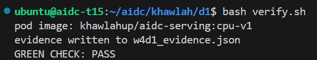

# Week 4, Day 1: first cluster

Environment: team pod t15 (browser IDE), NVIDIA RTX A6000, k3s (Kubernetes),
namespace `khawlah`. First day of week 4: the same container run with
`docker run` since week 2 does not change at all - what changes is who
starts it, watches it, and gives it a network.

## Predictions (filled before running anything)

| Question | Prediction |
|---|---|
| Where does the cluster's node live | On this same machine - k3s runs control plane and kubelet as one process on the box itself, not a separate container |
| What is /health waiting for before 200 | The app finishing startup, same readiness logic since week 2 |
| kubectl logs vs docker logs, same or different | Same output, only the command spelling differs |
| Which refusal comes from the scheduler itself | Pending |

## Actual results

### Step 0: seat on the team pod

```
export ME=khawlah
mkdir -p ~/aidc/$ME && cd ~/aidc/$ME
cp /etc/rancher/k3s/k3s.yaml kubeconfig && chmod 600 kubeconfig
export KUBECONFIG=~/aidc/$ME/kubeconfig
kubectl create namespace $ME
kubectl config set-context --current --namespace=$ME
```

```
namespace/khawlah created
Context "default" modified.
    namespace: khawlah
```

Confirmed: working in an isolated namespace, not "default", alongside three
teammates sharing the same pod.

### Step 1: the cluster already there

```
NAME       STATUS   ROLES           AGE   VERSION
aidc-t15   Ready    control-plane   38h   v1.36.4+k3s1
```

Container runtime: `containerd`, not Docker - confirms the prediction. k3s
runs the control plane and kubelet as one process on this exact machine;
`docker ps` would show none of it.

GPU confirmed in the scheduler's ledger:

```
GPU 0: NVIDIA RTX A6000
nvidia.com/gpu: 1
cpu: 28
memory: 59745596Ki
```

The scheduler counts the card the same way it counts CPU and memory. No pod
asks for it today - that starts Tuesday.

### Step 2: image already on Docker Hub

```
curl -sf https://hub.docker.com/v2/repositories/khawlahup/aidc-serving/tags/cpu-v1
-> Hub has it
```

Week 2's own `cpu-v1` tag, still public and pullable.

### Step 3: the three refusals, diagnosed

```
NAME    READY   STATUS             RESTARTS      AGE
pod-a   0/1     ImagePullBackOff   0             3m7s
pod-b   0/1     Pending            0             3m6s
pod-c   0/1     CrashLoopBackOff   4 (85s ago)   3m6s
```

| Pod | Status | Who refused | Cause |
|---|---|---|---|
| pod-a | ImagePullBackOff | The node's hands (kubelet) | Image tag does not exist; scheduler had already assigned it successfully |
| pod-b | Pending | The scheduler itself | Requested 64 CPUs, node only has 28 - "0/1 nodes are available: Insufficient cpu" |
| pod-c | CrashLoopBackOff | My own container | Started and exited immediately with exit code 1 (Started == Finished timestamp) |

Only pod-b's refusal came from the scheduler itself - the same shape
Tuesday's GPU contention will wear (`Insufficient nvidia.com/gpu`) when four
teammates ask for the one card at once.

Cleaned up per the lab's instruction (diagnosis is the deliverable, not a
fix):

```
kubectl delete -f broken/
```

### Step 4: the real pod

`pod.yaml` written by hand, image line pointed at the real Docker Hub tag,
`MODEL_BACKEND: echo` kept as-is (this week's objective is the cluster, not
the model):

```
NAME      READY   STATUS    RESTARTS   AGE
serving   1/1     Running   0          19s
```

Events confirmed the clean path: `Scheduled -> Pulled -> Created ->
Started`. Image digest (`sha256:39b16567afbc...`) matches week 2 day 3's own
push exactly - the same container, unmodified, now running under a
different operator.

`kubectl logs serving`, `kubectl exec -it serving -- /bin/sh`, and `kubectl
describe pod serving` all confirmed: same logs as `docker logs`, same
filesystem (`main.py`, `schemas.py`, `requirements.txt` inside `/app`), same
inspection detail as `docker inspect`, just under kubectl's spelling.

### Step 5: reached through the cluster

```
curl -s localhost:8002/health
-> {"status":"ok","model":"Qwen/Qwen2.5-0.5B-Instruct"}
```

Same contract, same app, new operator - the echo backend answering from
inside Kubernetes.

### Green check

```
pod image: khawlahup/aidc-serving:cpu-v1
evidence written to w4d1_evidence.json
GREEN CHECK: PASS
```

```json
{
  "cluster": "pod:aidc-t15",
  "namespace": "khawlah",
  "pod": "serving",
  "image": "khawlahup/aidc-serving:cpu-v1",
  "node": "aidc-t15",
  "chat_status": 200
}
```

`verify.sh` opened its own port-forward on a free port and confirmed
`/v1/models` and `/v1/chat/completions` both answered through the cluster
(status 200), not just that the pod was Running.



Files: `w4d1_evidence.json`
