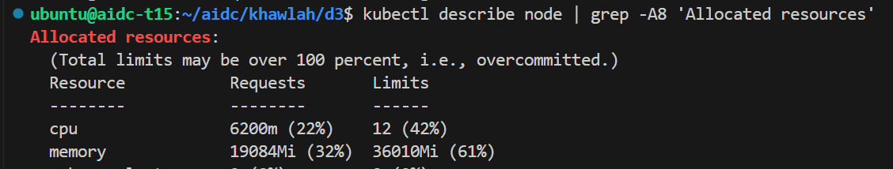
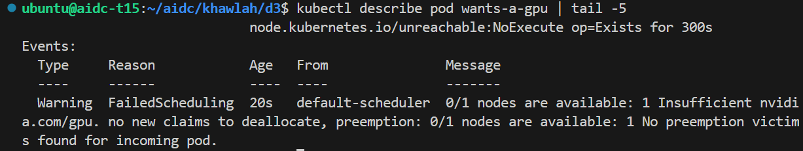
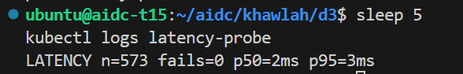
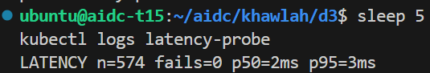

# Week 4, Day 3: GPUs in the scheduler's ledger

Environment: team pod t15, NVIDIA RTX A6000, k3s, namespace `khawlah`. Third
day of week 4: scheduling made visible as accounting - requests and limits
on the serving pods, two deliberate overdrafts (CPU then GPU), a measured
noisy-neighbour experiment, a written resource policy, and the team's real
vLLM engine entering the cluster on the shared card for the first time.

## Predictions (filled before running anything)

| Question | Prediction |
|---|---|
| A pod requests 64 CPUs on a 28-core node | Pending, not an apply error or a crash |
| A teammate already holds the one GPU, I request nvidia.com/gpu: 1 | Pending, with the event naming the GPU specifically |
| An unlimited noisy neighbour's effect on serving's /health latency | Somewhat to significantly worse; a CPU limit on the neighbour should improve it |

## Actual results

### Step 1: a ledger entry for the serving pods

```yaml
resources:
  requests:
    cpu: "250m"
    memory: "512Mi"
  limits:
    cpu: "1"
    memory: "3Gi"
```

Getting here took two real diagnostic passes, not the first attempt:

- **First attempt** (`memory limit: 512Mi`) produced `OOMKilled` (exit code
  137) - `kubectl top pods` showed the running pods actually resident at
  ~2.2-2.3 GB, far above the 512Mi ceiling. Raised the memory limit to 3Gi
  based on that measured number, not a guess.
- **Second attempt**, after the memory fix, produced `CrashLoopBackOff`
  again - but `kubectl logs` showed the container itself starting
  correctly (`Uvicorn running on http://0.0.0.0:8000`) and then loading a
  model in the background, only to be killed by the liveness probe before
  the load finished. Raised `livenessProbe.initialDelaySeconds` from 20 to
  90 seconds - the model load, not the container start, was the slow part.

Final result: both replicas `Running`, `0` restarts.

```
Allocated resources (node-wide):
cpu     6200m (22%) requested, 12 (42%) limits
memory  19084Mi (32%) requested, 36010Mi (61%) limits
```



### Step 2: overdraw CPU on purpose

```
impossible-cpu   0/1   Pending   0   0s
```

```
0/1 nodes are available: 1 Insufficient cpu. no new claims to deallocate,
preemption: 0/1 nodes are available: 1 Preemption is not helpful for scheduling.
```

No error on apply - the API accepted a valid wish; the scheduler simply
couldn't grant it, and said so in accounting language.

### Step 3: request the GPU while it's already held

The team's vLLM engine (Step 6, applied earlier by a teammate) already held
the pod's one card:

```
team   vllm-699b8896bc-tgmdb   1/1   Running   15h
```

Requesting it again from my own namespace:

```
wants-a-gpu   0/1   Pending   0   0s
```

```
0/1 nodes are available: 1 Insufficient nvidia.com/gpu. no new claims to
deallocate, preemption: 0/1 nodes are available: 1 No preemption victims
found for incoming pod.
```

Same shape as Step 2's CPU overdraft, same accounting language, this time
naming the GPU specifically - exactly what a mis-scheduled GPU workload
looks like on a real cluster: not a CUDA error, a pod that sits Pending
while the scheduler explains why in plain accounting terms.



### Step 4: the noisy neighbour, measured twice

20 burner replicas against the node's 28 cores (scaled up from the
lab's default of 2, sized for this pod rather than a 4-core laptop).

**Unlimited burners** (no CPU request or limit):

```
LATENCY n=573 fails=0 p50=2ms p95=3ms
```



**CPU-limited burners** (`limits: cpu: 500m` each):

```
LATENCY n=574 fails=0 p50=2ms p95=3ms
```



The limit produced no measurable difference in this run - both p95s landed
at 3ms. The reason is visible in Step 1: `serving` already carries a
guaranteed `250m` CPU *request*, so the kernel weights its share above
twenty BestEffort (unlimited) or Burstable (limited-but-requestless)
burner loops either way. The mechanism worked as designed in both cases;
the limit's absence didn't hurt because the protection was already coming
from serving's own request, not from constraining the neighbour.

### Step 5: the policy those numbers justify

```markdown
Serving:   requests cpu=250m/memory=512Mi, limits cpu=1/memory=3Gi -> Burstable
Batch:     requests cpu=100m/memory=128Mi, limits cpu=500m/memory=512Mi -> Burstable
Dashboard: no requests or limits -> BestEffort

Unlimited burners: n=573, p95=3ms, fails=0
Limited burners:   n=574, p95=3ms, fails=0
```

Policy sentence: protect serving with a guaranteed CPU request, throttle
batch with an explicit limit even though this specific test didn't show a
latency win from it, and let dashboard use only spare capacity. The
defense: batch's limit caps how much CPU any single worker can ever claim,
which protects against a scenario this particular 20-burner test didn't
create - a smaller number of much hungrier neighbours instead.

### Step 6: the team's engine (completed by the team, verified here)

Applied once, by a teammate, in the shared `team` namespace - not
per-student. Confirmed already running before this session's Step 3:

```
team   vllm-699b8896bc-tgmdb   1/1   Running   15h
```

`vllm-gpu.yaml` launches `Qwen/Qwen2.5-1.5B-Instruct-AWQ` (the exact
week-3 locked model and flags) with `requests == limits` on cpu, memory,
and `nvidia.com/gpu` - the combination that buys QoS class `Guaranteed`,
since a GPU request alone computes to `BestEffort` (Kubernetes derives QoS
from cpu/memory only). The Service is named `team-serving`, not `vllm`,
specifically to avoid Kubernetes' Docker-link env var injection
(`VLLM_PORT`) that would otherwise collide with vLLM's own port config and
kill the engine on its next restart.

### Green check

```
team engine: Guaranteed, GPU visible inside the container, Service name safe
overdraft verified: Pending with 'Insufficient nvidia.com/gpu'
GREEN CHECK: PASS
```

`verify.sh` checks three things end to end: my own serving deployment
carries a real ledger entry (requests and limits), the team's engine in
the `team` namespace is `Guaranteed` QoS with the GPU actually visible
inside its container (`nvidia-smi -L`, not just debited on the node's
ledger), and finally runs Step 3's overdraft experiment itself, demanding
the scheduler's own event text name `nvidia.com/gpu` before cleaning up.

Files: `deployment.yaml`, `policy.md`
