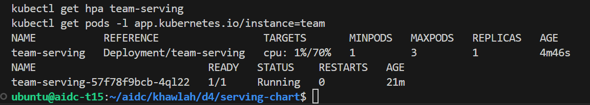
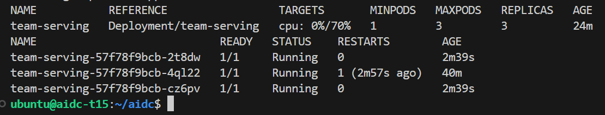
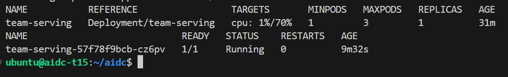
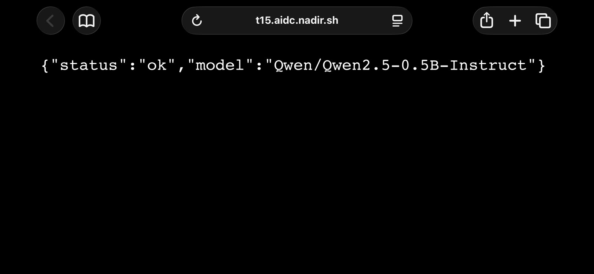

# Week 4, Day 4: package it, then let it breathe

Environment: team pod t15, NVIDIA RTX A6000, k3s, namespace `khawlah`.
Fourth day of week 4: the hand-written Deployment/Service from Monday
becomes a Helm chart, then gets a Horizontal Pod Autoscaler under the
team's chosen policy - watched scaling out under real load and back in
once the load stops.

Team policy: **Conservative** (targetCPUPercent: 70, maxReplicas: 3,
scaleDownStabilizationSeconds: 300).

## Predictions (filled before running anything)

| Question | Prediction |
|---|---|
| What Helm adds over hand-written YAML | Nothing new to Kubernetes itself - templated values and one named, versioned release |
| Whether two releases of the same chart can coexist | Yes, as long as they have different release names (different resource names) |
| Direction of replica count under load, then after load stops | Up under load (scale-out), back down after a stabilization delay (scale-in) |
| Whether CPU is the right autoscaling signal for a real GPU-bound vLLM engine | No - vLLM's expensive work happens on the GPU, not the CPU |

## Actual results

### Step 1-2: metrics-server and the template, before touching the cluster

`metrics-server` was already running cluster-wide (`unchanged` on apply -
a teammate's earlier setup). Confirmed live metrics before proceeding:

```
kubectl top pods -A
serving-...   2m   2638Mi
```

`helm template team .` rendered a Service and Deployment identical in
shape to Monday's hand-written YAML - every hard-won detail (`readinessProbe`,
`livenessProbe`, `maxUnavailable: 0`, the `preStop` sleep) survived
unchanged into the template; only `values.yaml` fills the blanks now.

### Step 3: install, prove coexistence, then two real failures to diagnose

`helm install team .` reported `STATUS: deployed` immediately, but the pod
itself went `CrashLoopBackOff` - Helm's own status is about the release
object, not the workload underneath it actually being healthy, so it does
not replace watching the pod.

**First cause**: `kubectl logs` was empty on every attempt; `kubectl
describe` showed `Readiness probe failed: connection refused` repeated for
36+ minutes with zero successes - the same shape as Tuesday's model-load
delay. Fixed by raising `initialDelaySeconds` from 20 to 90 in
`templates/deployment.yaml`.

**Second cause**, after the first fix: still `CrashLoopBackOff`, now with a
concrete signal - `kubectl describe`'s Last State showed `OOMKilled, Exit
Code: 137`, dying 6 seconds after start. The chart's default
`resources.limits.memory: 512Mi` in `values.yaml` was far below the ~2.2-2.3
GB this exact image actually needs (the same real number Tuesday's `kubectl
top` measured for this service). Raised `memory` limit to `3Gi` in
`values.yaml`. Confirming a teammate's chart independently carried the same
`initialDelaySeconds: 90` fix reinforced that this was the correct,
reproducible root cause, not a one-off.

```
team-serving-57f78f9bcb-4ql22   1/1   Running   0   100s
```

**Coexistence proven**: a second release, `shadow`, installed from the
same chart directory, reached `1/1 Running` alongside `team` with zero
collision - different release names produced different resource names
(`team-serving` vs `shadow-serving`) automatically. `helm list` showed both
`deployed` simultaneously before `shadow` was uninstalled.

### Step 4: HPA turned on, Conservative policy

```
kubectl get hpa team-serving
cpu: <unknown>/70%   REPLICAS: 0
```

`<unknown>` on the first read is expected - the HPA hadn't received its
first measurement from metrics-server yet. 30 seconds later:

```
cpu: 1%/70%   REPLICAS: 1
```



### Step 5: scale-out and scale-in, both measured live

24 simulated Locust users against the release for 4 minutes, watched from
a second terminal:

```
team-serving   cpu: 0%/70%   REPLICAS: 3
team-serving-...-2t8dw   Running   2m39s   (new)
team-serving-...-4ql22   Running   40m     (original)
team-serving-...-cz6pv   Running   2m39s   (new)
```

The HPA raised desired replicas from 1 to 3 under load - the exact "1 -> 3"
event the lab's own reference measurement names.



Five minutes after load stopped (the Conservative policy's own
`scaleDownStabilizationSeconds: 300`):

```
team-serving   cpu: 1%/70%   REPLICAS: 1
team-serving-...-cz6pv   Running   9m32s
```

Scale-in completed automatically, walking back down to the floor once the
stabilization window closed - no manual intervention either direction.



### Step 6: why CPU-based HPA is the wrong signal for a real vLLM engine

Today's HPA works because the `echo` backend is CPU-bound - every request
burns real CPU cycles generating a response, so CPU% tracks load exactly.
A real vLLM engine serving `Qwen2.5-1.5B-Instruct-AWQ` on the shared GPU
does not share that property: the expensive work (attention, KV cache
reads, matrix multiplies) happens on the GPU, not the CPU cores. Under
heavy concurrent load, GPU utilisation and memory pressure can climb
toward saturation while CPU usage barely moves - a CPU-based HPA watching
that engine would see flat, low CPU% throughout a real traffic spike and
never scale out. The correct signal would be GPU-native (utilisation,
memory pressure, or an application-level queue-depth metric through vLLM's
own metrics endpoint), which is week 5's territory (Prometheus/Grafana),
not today's.

### Step 7: the go-live tunnel, from a phone

```
service.type: NodePort, port 8000:30800
```

Opened `https://t15.aidc.nadir.sh/health` from a phone browser (a
different network entirely from the pod itself):

```json
{"status":"ok","model":"Qwen/Qwen2.5-0.5B-Instruct"}
```

Reverted the Service back to `ClusterIP` immediately after confirming it,
to avoid leaving the team's shared NodePort occupied by a personal test.



### Green check

`verify.sh` starts its own 24-thread load generator from inside the
cluster and waits up to three minutes for the HPA's own `desiredReplicas`
to rise above `minReplicas` - it does not trust a past scale event, it
demands a fresh one:

```
load running; waiting for the HPA to move (up to 3 minutes)
scale event observed: desired replicas 1 -> 3
GREEN CHECK: PASS
```

Files: `serving-chart/` (Chart.yaml, values.yaml, templates/), `hpa-failure-analysis.md`, `locustfile.py`, `verify.sh`
